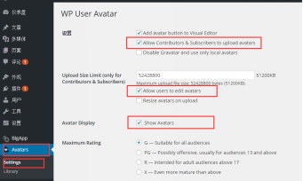

# 开源目的

通过使用该源码，开发者可以迅速地将Wordpress站点迁移到Android客户端中。不需要任何的开发工作即可拥有属于自己站点的Android客户端。

# 准备工作

在使用源码之前必须先在Wordpress站点中安装WP-BigApp插件。

####一、插件安装

1、安装WP-BigApp插件

> Wordpress -> 管理站点 -> 仪表盘 -> 插件 -> 安装插件 -> 搜索bigapp，点击WP-BigApp安装即可

2、安装Avatar插件（可选）

> 注：用于客户端用户头像上传和显示功能

> 该示例使用的图像插件是WP User Avatar，其配置如图：

      
# 使用说明

> 注：请使用Android Studio开发工具，gralde脚本编译

1、使用Android Studio导入项目    

2、在项目根目录下找到 needs_files 目录（包含所有配置文件）

> 各配置文件说明如下：

> a. ic_launcher_xx.png 

>> 代表的是您应用各种尺寸的icon

> b. ShareSDK.xml 

>> 分享key配置
      
>> 注：本app使用的是sharesdk第三方分享，请拷贝QQ、sina、微信开发者平台的key到此文件中

> c. demokey.keystore 

>> apk的签名文件，请替换成您的签名文件
    
>> 注：如果修改了签名文件的名称，还需修改app/build.gralde文件中的值"../needs_files/demokey.keystore"

> d. params.xml

>> APP功能配置项，其说明如下：
>>
    <Asset>
        <!-- nav bar的颜色 -->
        <nav_color>#FFFFFF</nav_color>
        <!-- app的名称 -->
        <app_name>bigApp</app_name>
        <!-- app的包名 -->
        <package_name>com.youzu.wp.bigword</package_name>
        <!-- 版本号 -->
        <version_name>1.0.1</version_name>
        <version_code>101</version_code>
        <svn_version>6719</svn_version>
        <!-- 您的站点地址 -->
        <api_url>http://wp.bigappdemo.com/</api_url>
        <!-- keystore 相关信息 -->
        <store_pwd>123456</store_pwd>
        <key_alias>demokey.keystore</key_alias>
        <key_pwd>123456</key_pwd>
        <!-- 使用QQ分享时用到的app_id-->
        <qq_app_id>1104849854</qq_app_id>
        <!-- 分享到qq、sina、微信;1代表启用，0代表不启用-->
        <use_qq>1</use_qq>
        <use_sina>1</use_sina>
        <use_wechat>1</use_wechat>  
    </Asset>
    
>> 注：其配置仅在编译release版本下全部有效；debug版本下仅package_name、version_name、svn_version、api_url、keystore配置有效，未生效的均采用默认值
    
3、编译运行

4、在项目根目录下找到 outputs目录

> 当执行gralde assembleRelease后会生成对应的release版本apk到此目录下面
