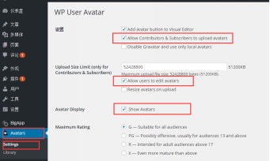

# 开源目的

通过使用该源码，开发者可以迅速地将Wordpress站点迁移到iOS客户端中。不需要任何的开发工作即可拥有属于自己站点的iOS客户端。

# 准备工作

在使用源码之前必须先在Wordpress站点中安装WP-BigApp插件。

####一、插件安装

1、安装WP-BigApp插件

> Wordpress -> 管理站点 -> 仪表盘 -> 插件 -> 安装插件 -> 搜索bigapp，点击WP-BigApp安装即可

2、安装Avatar插件（可选）

> 注：用于客户端用户头像上传和显示功能

> 该示例使用的图像插件是WP User Avatar，其配置如图：

      
# 使用说明

1、使用XCode打开YZWpClient.xcodeproj项目文件。

2、在XCode左侧的文件列表中找到Config.plistt文件（路径：YZWpClient/Supporting Files/Resources/Text/Config.plist）。

3、对Plist文件中的字段进行配置，其中配置项说明如下表所示：

|名称|说明|
|---------------|----------------|
|appHttpServer|站点地址|
|appNavigationbarColor|应用的导航栏颜色|
|appBundleId|应用的Bundle ID|
|appVersion|应用版本号|
|QQAppId|QQ开放平台应用的AppID（用于分享、登录）|
|QQAppSecret|QQ开放平台应用的AppSecret（用于分享、登录）|
|wechatAppId|微信开放平台应用的AppID（用于分享、登录）|
|wechatAppSecret|微信开放平台应用的AppSecret（用于分享、登录）|
|weiboAppKey|微博开放平台应用的AppKey（用于分享、登录）|
|weiboAppSecret|微博开放平台应用的AppSecret（用于分享、登录）|
|weiboRedirectUri|微博开放平台应用的授权回调地址（用于分享、登录）|

> 注：对于新浪、微信、QQ的应用信息设置，如果没有使用相关平台功能，可以不进行设置。

4、编译运行应用。
